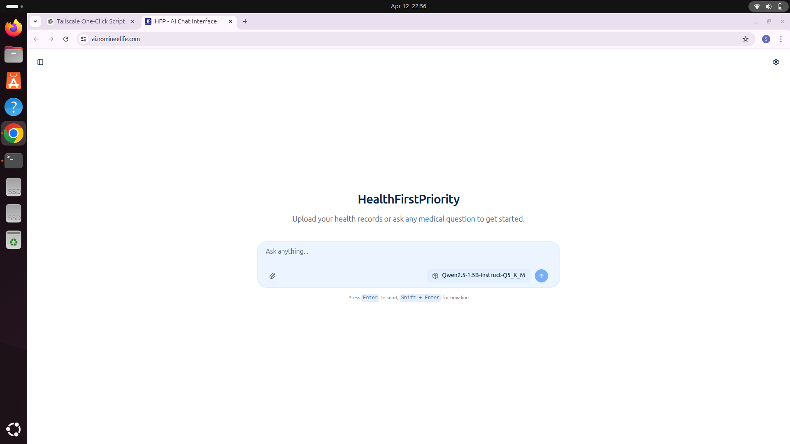

# 🚀 Llama Server + Tailscale One-Click Launcher

This project provides a simple Bash script to:

* 🔗 Connect to Tailscale VPN
* 🚀 Start a local LLM server using llama.cpp
* 🛑 Stop the server and disconnect cleanly

## 📦 Features

* One-click toggle script
* Automatically detects Tailscale status
* Starts/stops llama-server
* Supports remote access via Tailscale

## 🛠️ Requirements

* Tailscale installed
* llama.cpp built
* GGUF model file

## ⚙️ Usage

```bash
chmod +x tailscale-toggle.sh
./tailscale-toggle.sh
```

## 🌐 Access

Local:

```
https://ai.nomineelife.com/
```

Remote (via Tailscale):

```
http://<tailscale-ip>:8080
```

## 📌 Notes

* Model files are not included due to size
* Update paths in script before use

## 🧠 Tech Stack

* Bash scripting
* llama.cpp
* Tailscale VPN

## 📷 Demo


### 🖥️ Llama Server Running


### 🔗 Tailscale + Script Execution



---

## 👨‍💻 Author

Samarth Deshmukhe
